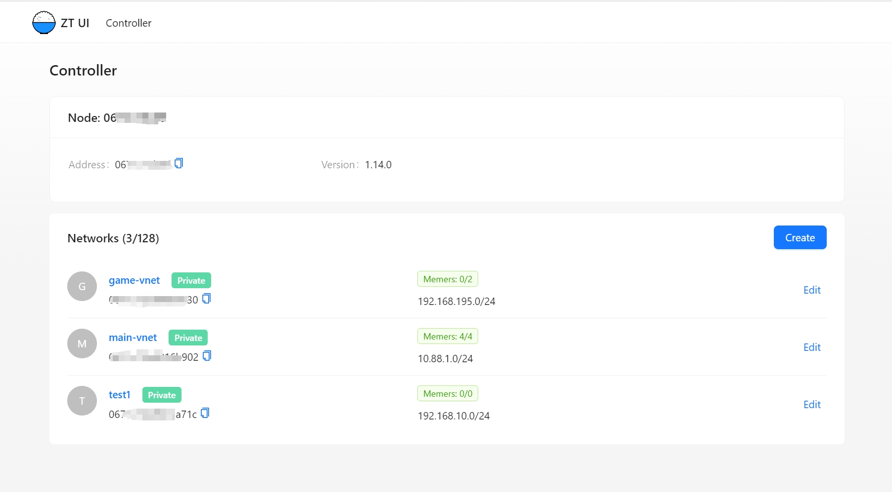
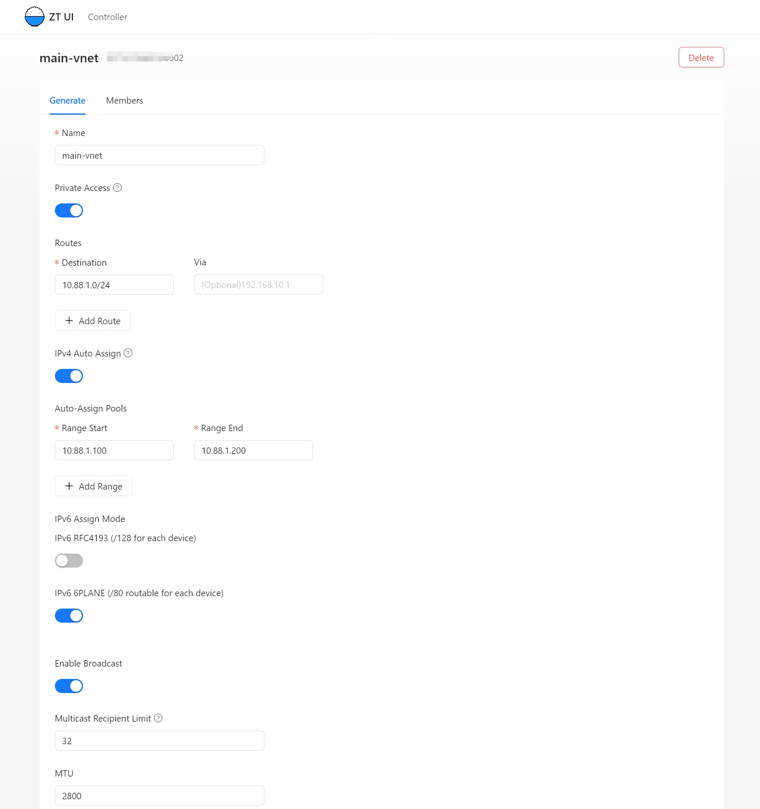
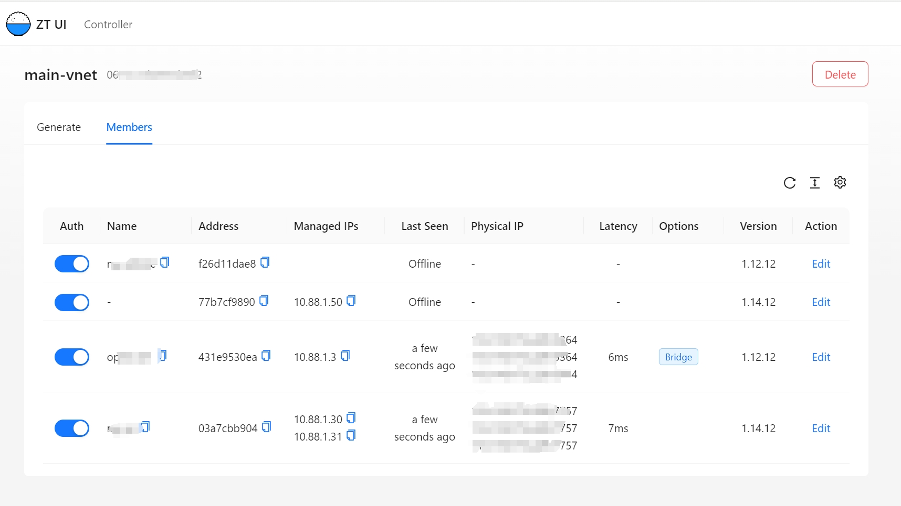
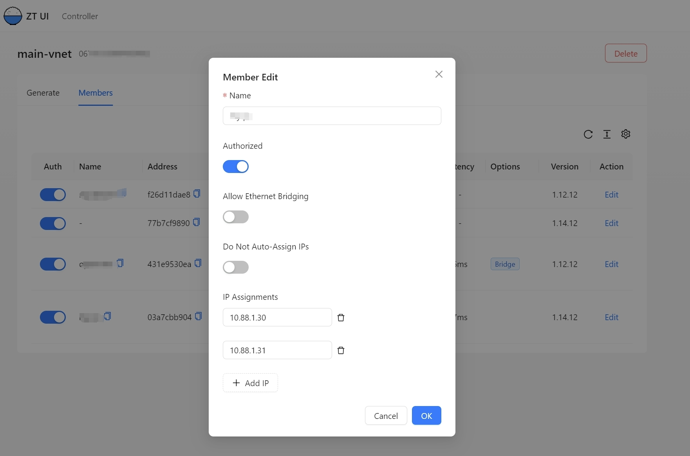

# ZeroTier Controller Web UI

ZeroTier Controller Web UI is a web user interface for a self-hosted ZeroTier network controller.

# Installation

## Docker

1. Download the [docker-compose.yml](./docker/docker-compose.yml) file

2. Change `ZU_USERNAME` and `ZU_PASSWORD` environment variables

3. Run `docker-compose up -d`

4. Navigate to http://localhost:5000

# Screenshots

# TODO

-   Logo file

# Built With

-   React
-   Ant Design
-   Caddy

# Thanks

https://github.com/dec0dOS/zero-ui
